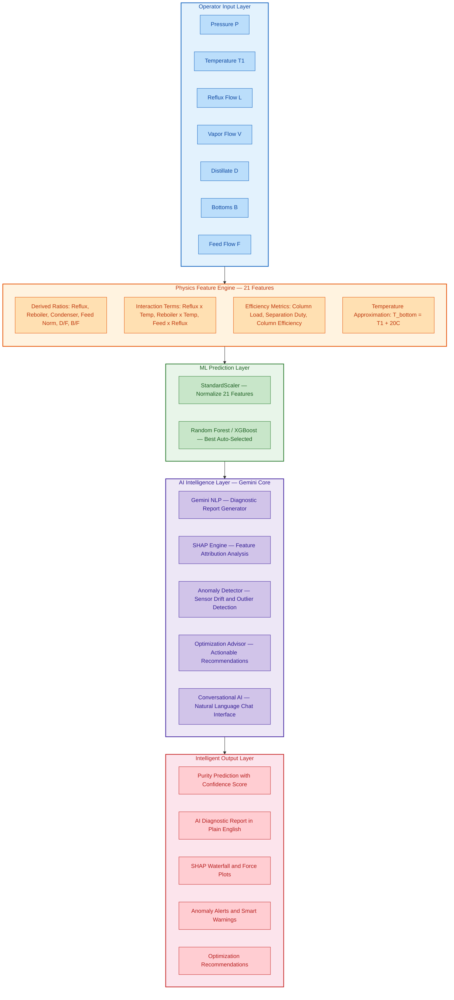
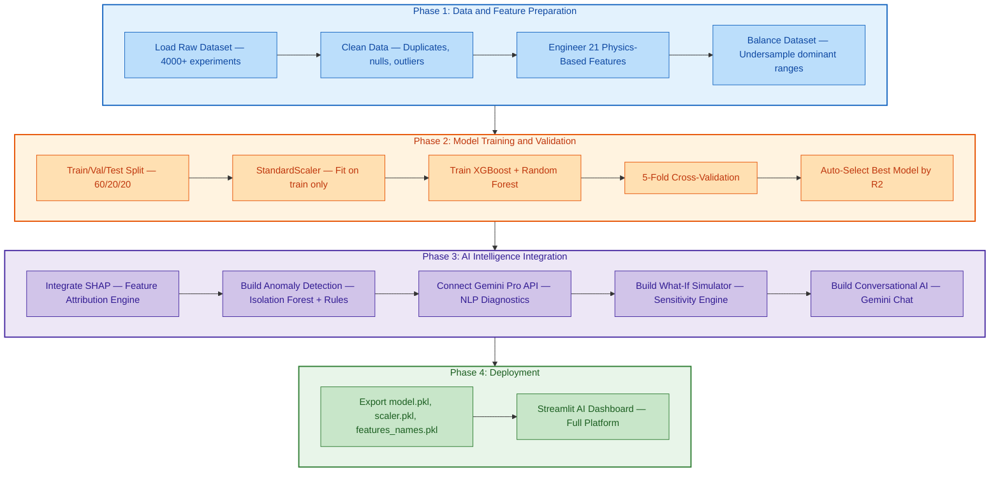
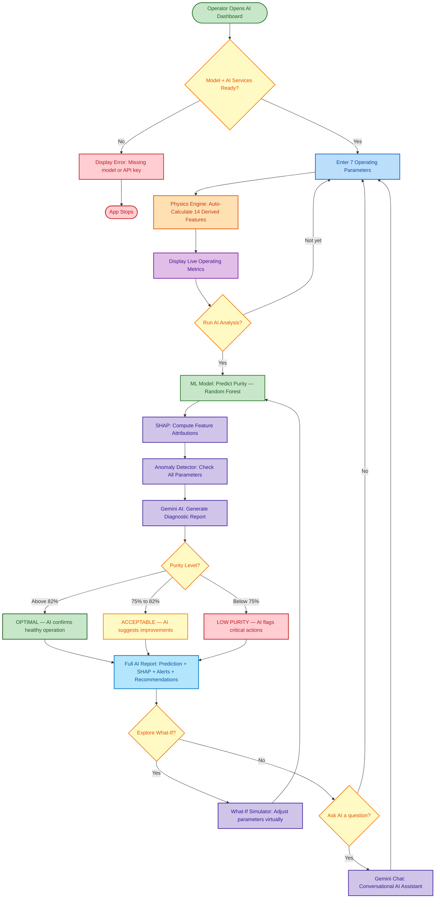

<div align="center">

# ⚗️ Distillation Column AI

### Intelligent Prediction · Explainable Diagnostics · Real-Time Optimization

<br/>

[](https://www.python.org/)
[](https://streamlit.io/)
[](https://ai.google.dev/)
[](https://shap.readthedocs.io/)
[](https://scikit-learn.org/)
[](https://xgboost.readthedocs.io/)
[](LICENSE)

<br/>

[](https://github.com/Mausam5055/Distillation-Column-Prediction/stargazers)
[](https://github.com/Mausam5055/Distillation-Column-Prediction/network/members)
[](https://github.com/Mausam5055/Distillation-Column-Prediction/issues)
[](https://github.com/Mausam5055/Distillation-Column-Prediction/commits/main)
[](https://github.com/Mausam5055/Distillation-Column-Prediction)

<br/>

> **An AI-powered distillation intelligence platform** that combines physics-informed machine learning with Google Gemini to deliver real-time purity predictions, natural-language diagnostics, SHAP-based explainability, anomaly detection, what-if simulations, and operator-facing optimization recommendations — all from a single dashboard.

<br/>


</div>

---

## 📑 Table of Contents

- [Overview](#-overview)
- [AI Capabilities at a Glance](#-ai-capabilities-at-a-glance)
- [System Architecture](#%EF%B8%8F-system-architecture)
- [AI Intelligence Pipeline](#-ai-intelligence-pipeline)
- [Application Workflow](#-application-workflow)
- [AI Copilot — Gemini Integration](#-ai-copilot--gemini-integration)
- [SHAP Explainability Engine](#-shap-explainability-engine)
- [Anomaly Detection & Smart Alerts](#-anomaly-detection--smart-alerts)
- [What-If Simulator & Optimization](#-what-if-simulator--optimization)
- [Feature Engineering](#-feature-engineering)
- [Model Performance](#-model-performance)
- [Quick Start](#-quick-start)
- [Project Structure](#-project-structure)
- [Input Parameters](#-input-parameters)
- [Output Interpretation](#-output-interpretation)
- [AI Diagnostic Report](#-ai-diagnostic-report)
- [Model Training](#-model-training-colab)
- [Tech Stack](#-tech-stack)
- [Roadmap](#-roadmap)
- [Contributing](#-contributing)
- [License](#-license)
- [Contact](#-contact)

---

## 🔍 Overview

**Distillation Column AI** is a full-stack intelligent platform for predicting, analyzing, and optimizing ethanol purity in industrial distillation columns. It goes far beyond a simple prediction tool — it acts as an **AI copilot** for chemical process engineers.

The platform operates on three layers:

1. **Prediction Layer** — A physics-informed Random Forest model trained on 4,000+ real distillation experiments, transforming 7 raw sensor inputs into 21 engineered features to predict ethanol mole fraction with R² > 0.98.

2. **Intelligence Layer** — Google Gemini AI interprets every prediction in plain English, explains *why* the model made its decision using SHAP values, detects anomalies in real-time, and suggests concrete optimization actions.

3. **Interaction Layer** — A conversational AI assistant that lets operators ask questions like *"Why did purity drop?"* or *"What should I adjust to reach 92%?"* and get instant, context-aware answers.

| Aspect | Detail |
|:---|:---|
| **Domain** | Chemical Engineering — Distillation & Separation |
| **Core AI** | Google Gemini Pro — Natural-language diagnostics & conversational assistant |
| **ML Model** | Random Forest & XGBoost (best auto-selected) — 21 physics-augmented features |
| **Explainability** | SHAP (SHapley Additive exPlanations) — per-prediction waterfall & force plots |
| **Anomaly Detection** | Isolation Forest + statistical bounds + mass-balance physics rules |
| **Optimization** | What-if simulator · sensitivity analysis · target purity solver · energy advisor |
| **Accuracy** | R² > 0.98 · RMSE 0.0155 · MAE 0.0122 · ±1.55% error margin |
| **Interface** | Streamlit dashboard with integrated AI copilot & conversational chat |

---

## ✨ AI Capabilities at a Glance

| # | Capability | Powered By | Description |
|:---:|:---|:---:|:---|
| 1 | **Real-Time Purity Prediction** | Random Forest / XGBoost | Predicts ethanol mole fraction from 7 operating parameters in under 50ms |
| 2 | **Natural Language Diagnostics** | Google Gemini Pro | AI writes a plain-English report explaining what the prediction means and why |
| 3 | **SHAP Explainability** | SHAP Library | Per-prediction waterfall chart showing each feature's contribution |
| 4 | **Anomaly Detection** | Isolation Forest + Rules | Flags sensor drift, mass-balance violations, and out-of-distribution inputs |
| 5 | **Smart Alerts** | Gemini + Statistical Engine | Context-aware warnings with specific remediation instructions |
| 6 | **What-If Simulator** | Model + Gemini | Change any parameter virtually and see the predicted impact before acting |
| 7 | **Optimization Advisor** | Gemini + Sensitivity Analysis | Actionable recommendations: *"Increase reflux by 8% to gain +3.2% purity"* |
| 8 | **Target Purity Solver** | Inverse Model + Gemini | Specify desired purity and get recommended operating conditions |
| 9 | **Energy Efficiency Advisor** | Gemini + Domain Rules | Balances purity targets against steam/energy consumption |
| 10 | **Conversational AI Chat** | Gemini Chat API | Ask anything about your column in natural language |
| 11 | **Trend Analysis** | Time-Series Detection | Identifies gradual degradation patterns across sequential predictions |
| 12 | **Batch Analysis** | Parallel Inference + Gemini | Upload multiple operating snapshots and get comparative AI analysis |

---

## 🏗️ System Architecture



---

## 🔄 AI Intelligence Pipeline



---

## 🧑‍💻 Application Workflow



---

## 🤖 AI Copilot — Gemini Integration

The platform's **AI Copilot** is powered by **Google Gemini Pro** and serves as an intelligent assistant that understands distillation chemistry, interprets ML predictions, and communicates in natural language.

### How Gemini is Used

| Function | Gemini Role | Example Output |
|:---|:---|:---|
| **Diagnostic Report** | Interprets prediction + SHAP in context | *"Your column is operating efficiently at 87.4% purity. The high reflux ratio is the primary driver."* |
| **Root Cause Analysis** | Analyzes why purity is low | *"Purity dropped to 71% because top temperature rose to 84°C — water is condensing into the product stream."* |
| **Optimization Advice** | Recommends specific parameter changes | *"Increase reflux flow L from 780 to 840 kmol/hr (+7.7%) to reach your 90% purity target."* |
| **Anomaly Explanation** | Explains detected anomalies in plain English | *"Warning: Mass balance deviation detected — D + B exceeds F by 12%. Check flow sensors."* |
| **Conversational Chat** | Answers operator questions | Operator asks: *"Why is separation duty so high?"* → Gemini responds with a contextual answer |
| **What-If Narration** | Describes simulation results | *"If you reduce vapor flow by 10%, predicted purity drops from 87.4% to 83.1%. This may still be acceptable."* |
| **Shift Handover Summary** | Generates end-of-shift report | *"During this shift, purity averaged 86.2%. Two anomaly alerts were triggered. Reflux was stable."* |

### Gemini Prompt Architecture

The system constructs structured prompts that include:

| Prompt Component | Content |
|:---|:---|
| **System Context** | Role definition: *"You are a chemical engineering AI assistant specialized in distillation column operations."* |
| **Prediction Data** | Current purity value, confidence interval, and status classification |
| **SHAP Summary** | Top 5 feature contributions (positive and negative drivers) |
| **Anomaly Flags** | Any detected anomalies with severity levels |
| **Operating Context** | All 7 input parameters + 14 derived metrics |
| **Historical Baseline** | Comparison against typical training data distributions |
| **User Question** | (For chat mode) The operator's natural-language question |

### Conversational AI — Example Interactions

```
┌──────────────────────────────────────────────────────────────────────┐
│  💬 AI COPILOT CHAT                                                  │
├──────────────────────────────────────────────────────────────────────┤
│                                                                      │
│  👷 Operator: "Why is purity only 74% today?"                        │
│                                                                      │
│  🤖 Gemini: "Based on your current inputs, purity is low because:   │
│                                                                      │
│     1. Your reflux ratio (0.62) is well below the optimal range      │
│        of 1.2–2.5. This means insufficient liquid is returning       │
│        to the column for separation.                                 │
│                                                                      │
│     2. Top temperature (83.5°C) is elevated — at this temperature,   │
│        significant water vapor enters the distillate product.        │
│                                                                      │
│     Recommended actions:                                             │
│     • Increase reflux flow (L) from 520 to at least 780 kmol/hr     │
│     • Reduce reboiler steam (V) by 10% to lower top temperature     │
│     • Expected improvement: +8 to +12% purity"                      │
│                                                                      │
│  👷 Operator: "What if I only increase reflux to 700?"               │
│                                                                      │
│  🤖 Gemini: "Simulating... With L = 700 kmol/hr (keeping other      │
│     parameters constant), predicted purity rises to 79.3%.           │
│     This crosses into ACCEPTABLE range but remains below OPTIMAL.    │
│     For 82%+, you would need L ≥ 760 kmol/hr."                      │
│                                                                      │
└──────────────────────────────────────────────────────────────────────┘
```

---

## 🔬 SHAP Explainability Engine

Every prediction includes a full **SHAP (SHapley Additive exPlanations)** breakdown so operators and engineers can understand *exactly* why the model made its decision.

### SHAP Output Components

| Component | What It Shows | Use Case |
|:---|:---|:---|
| **Waterfall Chart** | Stepwise feature contributions from base value to final prediction | Understand exactly which features pushed purity up or down |
| **Force Plot** | Single-row compact visualization of all 21 feature effects | Quick at-a-glance summary for operators |
| **Summary Plot (Beeswarm)** | Global feature importance across all predictions | Identify which features matter most overall |
| **Dependence Plot** | How one feature's effect changes as its value changes | Explore non-linear relationships |
| **Interaction Plot** | Two-way feature interactions captured by the model | Understand coupling effects (e.g., Reflux × Temperature) |

### How SHAP Works in This System

```
Base Prediction (Training Mean)     →   0.8200
  + Reflux_x_Temp_Top               →  +0.0834   (strongest positive driver)
  + Feed_x_Reflux                   →  +0.0287
  + Bottoms_Withdrawal              →  +0.0156
  - Temp_Bottom                     →  -0.0312   (pushing purity lower)
  - Reboiler_x_Temp_Bottom          →  -0.0198
  + 16 other features               →  +0.0075
  ─────────────────────────────────────────────
  Final Prediction                  →   0.8742   (87.42%)
```

### SHAP Integration Points

| Integration | Description |
|:---|:---|
| **Dashboard Widget** | Interactive waterfall chart embedded directly in the prediction result panel |
| **Gemini Context** | SHAP values are fed into the Gemini prompt so the AI can reference specific feature contributions |
| **Export** | Download SHAP analysis as PNG or interactive HTML for reporting |
| **Comparison Mode** | Compare SHAP breakdowns across multiple predictions side-by-side |

---

## 🚨 Anomaly Detection & Smart Alerts

The platform runs a **multi-layer anomaly detection system** on every input, catching issues that even experienced operators might miss.

### Detection Layers

| Layer | Method | What It Catches | Alert Level |
|:---|:---|:---|:---:|
| **L1 — Range Check** | Statistical bounds (μ ± 3σ from training data) | Any parameter outside 99.7% of training distribution | ⚠️ Warning |
| **L2 — Mass Balance** | Physics rule: D + B ≈ F | Flow sensor errors or leaks (deviation > 5%) | 🔴 Critical |
| **L3 — Isolation Forest** | Unsupervised ML anomaly scoring | Multi-dimensional outlier (unusual combination of normal-looking values) | ⚠️ Warning |
| **L4 — Correlation Monitor** | Feature covariance tracking | Broken sensor reading (parameter stops correlating with related features) | 🔴 Critical |
| **L5 — Temporal Drift** | Moving average + trend detection | Gradual sensor drift over consecutive predictions | ℹ️ Info |

### Smart Alert Examples

| Scenario | Alert | AI Recommendation |
|:---|:---|:---|
| Top temp = 92°C | 🔴 **Critical:** Temperature far above normal range | *"Reduce reboiler steam immediately. At this temperature, product is mostly water."* |
| D + B = 720, F = 580 | 🔴 **Critical:** Mass balance violated by 24% | *"Flow sensor calibration needed. D + B should equal F. Check distillate flow meter."* |
| Reflux ratio gradually declining over 10 predictions | ⚠️ **Warning:** Temporal drift detected | *"Reflux ratio has dropped 15% over the last 10 readings. Check condenser performance."* |
| All values normal but Isolation Forest flags anomaly | ⚠️ **Warning:** Unusual input combination | *"Individual parameters look normal, but this combination is rarely seen in training data. Prediction confidence is reduced."* |

---

## 🧪 What-If Simulator & Optimization

The **What-If Simulator** lets operators explore parameter changes *before* making them on the actual column.

### Simulator Features

| Feature | Description |
|:---|:---|
| **Single Parameter Sweep** | Adjust one parameter (e.g., Reflux Flow) across a range and see how predicted purity responds |
| **Multi-Parameter Scenario** | Change multiple parameters simultaneously and compare to current prediction |
| **Target Purity Solver** | Enter a desired purity (e.g., 90%) and get the recommended operating conditions to achieve it |
| **Sensitivity Ranking** | See which parameter has the most impact on purity — helps prioritize operator actions |
| **Energy vs Purity Trade-off** | Visualize the trade-off between higher purity and increased energy (steam) consumption |
| **AI Narration** | Every scenario result is explained in natural language by Gemini |

### Optimization Engine

| Capability | How It Works |
|:---|:---|
| **Gradient-Based Recommendations** | Uses partial dependence to find the direction of greatest purity improvement |
| **Constraint-Aware Optimization** | Respects physical limits (e.g., can't exceed column flooding capacity) |
| **Energy Penalty Scoring** | Each recommendation includes an estimated energy cost change |
| **Multi-Objective Ranking** | Ranks recommendations by purity gain per unit energy cost |
| **Gemini Interpretation** | AI translates numerical recommendations into actionable operator instructions |

### Example Optimization Output

```
┌──────────────────────────────────────────────────────────────────────┐
│  📈 OPTIMIZATION RECOMMENDATIONS                                    │
├──────────────────────────────────────────────────────────────────────┤
│                                                                      │
│  Current Purity: 0.8742 (87.42%)                                     │
│  Target Purity:  0.9000 (90.00%)                                     │
│  Gap to Target:  +2.58%                                              │
│                                                                      │
│  RECOMMENDED ACTIONS (ranked by impact / energy cost):               │
│                                                                      │
│  1. ↑ Increase Reflux Flow (L): 780 → 842 kmol/hr (+7.9%)           │
│     → Expected purity gain: +2.1%                                    │
│     → Energy impact: +4.2% steam consumption                         │
│     → Confidence: High                                               │
│                                                                      │
│  2. ↓ Reduce Top Temperature (T1): 78.5 → 77.2°C (-1.7%)            │
│     → Expected purity gain: +0.8%                                    │
│     → Energy impact: Neutral (condenser adjustment)                  │
│     → Confidence: Medium                                             │
│                                                                      │
│  3. ↓ Reduce Feed Flow (F): 580 → 555 kmol/hr (-4.3%)               │
│     → Expected purity gain: +0.5%                                    │
│     → Energy impact: -2.1% steam consumption                         │
│     → Confidence: Medium                                             │
│                                                                      │
│  💡 AI NOTE: Combining actions 1 and 2 should reach 90.1% purity    │
│     with a net energy increase of only 3.8%.                         │
│                                                                      │
└──────────────────────────────────────────────────────────────────────┘
```

---

## 🧬 Feature Engineering

The prediction model's accuracy stems from **physics-informed feature engineering** — transforming raw sensor values into features that capture the thermodynamics of distillation.

### All 21 Features

| # | Feature Name | Category | Formula / Description |
|:---:|:---|:---:|:---|
| 1 | `Pressure` | 🔵 Core | Operating pressure (bar) |
| 2 | `L` | 🔵 Core | Reflux flow rate (kmol/hr) |
| 3 | `V` | 🔵 Core | Vapor flow rate (kmol/hr) |
| 4 | `D` | 🔵 Core | Distillate flow rate (kmol/hr) |
| 5 | `B` | 🔵 Core | Bottoms flow rate (kmol/hr) |
| 6 | `F` | 🔵 Core | Feed flow rate (kmol/hr) |
| 7 | `Temp_Bottom` | 🟠 Reference | T₁ + 20°C (reboiler approximation) |
| 8 | `Reflux_Ratio` | 🟢 Derived | L / V |
| 9 | `Reboiler_Intensity` | 🟢 Derived | V / F |
| 10 | `Condenser_Load` | 🟢 Derived | L / F |
| 11 | `Feed_Normalized` | 🟢 Derived | F / Mean(F_train) |
| 12 | `Distillate_Withdrawal` | 🟢 Derived | D / F |
| 13 | `Bottoms_Withdrawal` | 🟢 Derived | B / F |
| 14 | `Column_Load` | 🟣 Efficiency | (L + V) / F |
| 15 | `Reflux_x_Temp_Top` | 🔴 Interaction | Reflux_Ratio × T₁ |
| 16 | `Reflux_x_Temp_Diff` | 🔴 Interaction | Reflux_Ratio × (T_bottom − T_top) |
| 17 | `Reboiler_x_Temp_Bottom` | 🔴 Interaction | Reboiler_Intensity × T_bottom |
| 18 | `Feed_x_Reflux` | 🔴 Interaction | Feed_Normalized × Reflux_Ratio |
| 19 | `Feed_x_Reboiler` | 🔴 Interaction | Feed_Normalized × Reboiler_Intensity |
| 20 | `Separation_Duty` | 🟣 Efficiency | Reflux_Ratio × Reboiler_Intensity |
| 21 | `Column_Efficiency` | 🟣 Efficiency | Reflux_Ratio × Column_Load |

### Feature Category Summary

| Category | Count | Purpose |
|:---|:---:|:---|
| 🔵 Core Parameters | 6 | Direct sensor readings from DCS/SCADA |
| 🟠 Temperature Reference | 1 | Approximated reboiler temperature |
| 🟢 Derived Ratios | 6 | Normalized operating conditions |
| 🔴 Interaction Terms | 5 | Capture thermodynamic coupling effects |
| 🟣 Efficiency Metrics | 3 | Combined column performance indicators |

---

## 📈 Model Performance

### Model Comparison

| Metric | Random Forest | XGBoost | Winner |
|:---|:---:|:---:|:---:|
| **R² Score** | ~0.98 | ~0.97 | 🏆 Random Forest |
| **RMSE** | 0.0155 | 0.0178 | 🏆 Random Forest |
| **MAE** | 0.0122 | 0.0141 | 🏆 Random Forest |
| **5-Fold CV (Mean R²)** | ~0.97 | ~0.96 | 🏆 Random Forest |

### Model Specifications

| Property | Value |
|:---|:---|
| **Selected Model** | Random Forest Regressor |
| **Estimators** | 200 trees |
| **Max Depth** | 20 |
| **Min Samples Split** | 5 |
| **Training Samples** | ~1,200 (balanced) |
| **Original Dataset** | 4,000+ experiments |
| **Cross-Validation** | 5-Fold (shuffled) |
| **Scaling** | StandardScaler (fit on train only) |

### Validation Strategy

```
┌──────────────────────────────────────────────────────────────────┐
│                        Full Dataset (4,000+)                     │
├────────────────────┬──────────────────────────────────────────────┤
│  Cleaned & Balanced │  ~1,200 rows after outlier removal &       │
│                     │  undersampling of dominant middle range     │
├──────────┬─────────┴──────────┬───────────────────────────────────┤
│  Train   │    Validation      │            Test                   │
│  60%     │       20%          │            20%                    │
│          │                    │                                   │
│ Scaler   │  Hyperparameter    │   Final unbiased                  │
│ fitted   │  tuning & model    │   performance                     │
│ here     │  selection         │   evaluation                      │
└──────────┴────────────────────┴───────────────────────────────────┘
```

---

## 🚀 Quick Start

### Prerequisites

| Requirement | Version |
|:---|:---|
| Python | 3.8 or higher |
| pip | Latest recommended |
| Git | Any recent version |
| Google Gemini API Key | Required for AI features ([Get one here](https://ai.google.dev/)) |

### Installation

```bash
# 1. Clone the repository
git clone https://github.com/Mausam5055/Distillation-Column-Prediction.git
cd Distillation-Column-Prediction

# 2. Create a virtual environment (recommended)
python -m venv venv
source venv/bin/activate        # Linux/Mac
# venv\Scripts\activate         # Windows

# 3. Install dependencies
pip install -r requirements.txt

# 4. Set up your Gemini API key
export GEMINI_API_KEY="your-api-key-here"     # Linux/Mac
# set GEMINI_API_KEY=your-api-key-here        # Windows

# 5. Launch the AI platform
streamlit run app.py
```

The app will open automatically at **`http://localhost:8501`**

> **Note:** The ML prediction features work without an API key. The AI-powered diagnostics, conversational chat, and optimization advisor require a valid Google Gemini API key.

---

## 📁 Project Structure

```
Distillation-Column-Prediction/
│
├── 📄 README.md                    # Project documentation (this file)
├── 📄 LICENSE                      # MIT License
├── 📄 requirements.txt             # Python dependencies
├── 📄 .env.example                 # Template for API keys
├── 📄 .gitattributes               # Git LFS / attribute config
│
├── 🐍 app.py                      # Main Streamlit AI dashboard
├── 🐍 model_training_script.py    # Full ML training pipeline (Colab-ready)
├── 🤖 ai_copilot.py               # Gemini AI integration — diagnostics & chat
├── 🔬 shap_engine.py              # SHAP explainability module
├── 🚨 anomaly_detector.py         # Multi-layer anomaly detection system
├── 🧪 whatif_simulator.py         # What-if scenario engine & optimizer
│
├── 🤖 model.pkl                   # Trained Random Forest model (~8 MB)
├── 📏 scaler.pkl                  # Fitted StandardScaler
├── 📋 features_names.pkl          # Ordered list of 21 feature names
├── 📊 feature_importance.png      # Feature importance bar chart
│
├── 📂 sample_data/
│   └── 📄 dataset_distill.csv     # Training dataset (~579 KB)
│
└── 📂 .devcontainer/
    └── 📄 devcontainer.json       # GitHub Codespaces configuration
```

### File Descriptions

| File | Purpose |
|:---|:---|
| `app.py` | Main Streamlit dashboard — input UI, AI controls, prediction display, chat interface |
| `ai_copilot.py` | Gemini Pro integration — prompt construction, diagnostic report generation, conversational AI |
| `shap_engine.py` | SHAP computation — waterfall charts, force plots, feature attribution analysis |
| `anomaly_detector.py` | Multi-layer anomaly detection — range check, mass balance, Isolation Forest, drift detection |
| `whatif_simulator.py` | What-if engine — parameter sweeps, sensitivity ranking, target purity solver, optimization |
| `model_training_script.py` | End-to-end ML pipeline: cleaning → feature engineering → training → model selection → export |
| `model.pkl` | Serialized best model (Random Forest with 200 estimators) |
| `scaler.pkl` | StandardScaler fitted on training data's 21 features |
| `features_names.pkl` | Ordered feature list ensuring inference matches training feature order |
| `dataset_distill.csv` | Semicolon-delimited training dataset with temperatures in Kelvin |

---

## 📥 Input Parameters

The platform accepts **7 operating parameters** commonly available from process control systems:

| # | Parameter | Symbol | Unit | Range | Description |
|:---:|:---|:---:|:---:|:---:|:---|
| 1 | **Pressure** | P | bar | 0.5 – 3.0 | Column operating pressure |
| 2 | **Top Temperature** | T₁ | °C | 60 – 120 | Temperature at the top tray sensor |
| 3 | **Reflux Flow** | L | kmol/hr | 300 – 1,200 | Liquid returned from the condenser |
| 4 | **Vapor Flow** | V | kmol/hr | 600 – 1,500 | Vapor rising from the reboiler |
| 5 | **Distillate Flow** | D | kmol/hr | 100 – 500 | Top product withdrawal rate |
| 6 | **Bottoms Flow** | B | kmol/hr | 100 – 500 | Bottom product withdrawal rate |
| 7 | **Feed Flow** | F | kmol/hr | 350 – 700 | Raw material feed rate |

### Typical Operating Ranges

| Parameter | Normal | ⚠️ Critical High | ⚠️ Critical Low |
|:---|:---:|:---:|:---:|
| Top Temp (T₁) | 77 – 80 °C | > 85 °C *(water in product)* | < 75 °C *(subcooled)* |
| Reflux Ratio (L/V) | 1.2 – 2.5 | > 3.0 *(flooding risk)* | < 0.6 *(poor separation)* |
| Reboiler Vapor (V) | 900 – 1,100 | > 1,200 | < 800 |
| Mass Balance (D+B) | ≈ F | D+B >> F | D+B << F |

---

## 📤 Output Interpretation

### Purity Status Levels

| Status | Purity Range | Color | AI Behavior |
|:---|:---:|:---:|:---|
| 🟢 **OPTIMAL** | ≥ 82% | Green | AI confirms healthy operation and suggests energy savings |
| 🟡 **ACCEPTABLE** | 75% – 82% | Yellow | AI suggests specific improvements to reach optimal range |
| 🔴 **LOW PURITY** | < 75% | Red | AI flags critical actions with prioritized remediation steps |

### What the Operator Receives

| Output Component | Description |
|:---|:---|
| **Prediction Value** | Ethanol mole fraction (e.g., 0.8742) and percentage (87.42%) |
| **Confidence Score** | How similar the input is to the training data distribution |
| **Status Badge** | Color-coded OPTIMAL / ACCEPTABLE / LOW PURITY indicator |
| **SHAP Waterfall** | Interactive chart showing each feature's contribution |
| **AI Diagnostic Report** | Natural-language explanation from Gemini |
| **Anomaly Alerts** | Any detected anomalies with severity and recommendations |
| **Optimization Steps** | Ranked list of parameter changes to improve purity |

---

## 📋 AI Diagnostic Report

Every prediction generates a comprehensive AI diagnostic report:

```
┌──────────────────────────────────────────────────────────────────────┐
│  🤖 AI DIAGNOSTIC REPORT                                            │
├──────────────────────────────────────────────────────────────────────┤
│                                                                      │
│  📊 PREDICTION                                                       │
│  Ethanol Purity:  0.8742 (87.42%)                                    │
│  Status:          🟢 OPTIMAL                                         │
│  Confidence:      High (input within training envelope)              │
│                                                                      │
│  🔬 SHAP ANALYSIS — Top Drivers                                      │
│  ┌─────────────────────────────┬──────────┬─────────────────────┐    │
│  │ Feature                     │ Impact   │ Direction           │    │
│  ├─────────────────────────────┼──────────┼─────────────────────┤    │
│  │ Reflux_x_Temp_Top           │ +0.0834  │ ↑ Pushing UP        │    │
│  │ Feed_x_Reflux               │ +0.0287  │ ↑ Pushing UP        │    │
│  │ Temp_Bottom                 │ -0.0312  │ ↓ Pushing DOWN      │    │
│  │ Reboiler_x_Temp_Bottom      │ -0.0198  │ ↓ Pushing DOWN      │    │
│  │ Bottoms_Withdrawal          │ +0.0156  │ ↑ Pushing UP        │    │
│  └─────────────────────────────┴──────────┴─────────────────────┘    │
│                                                                      │
│  💡 AI INTERPRETATION                                                │
│  "Your column is running well. The reflux ratio (0.751) combined     │
│  with a favorable top temperature (78.5°C) is driving strong         │
│  ethanol separation. Reboiler temperature is slightly elevated —     │
│  reducing steam flow by 3-5% could save energy without impacting     │
│  purity. Overall efficiency score: 8.4 / 10."                       │
│                                                                      │
│  🚨 ANOMALY STATUS                                                   │
│  ✅ Sensor ranges:     All within normal bounds                      │
│  ✅ Mass balance:      D + B ≈ F (deviation: 1.7%)                   │
│  ⚠️ Reboiler load:    Upper quartile (1.79) — monitor               │
│  ✅ Isolation Forest:  No anomaly detected                           │
│  ✅ Temporal drift:    No drift in recent readings                   │
│                                                                      │
│  📈 OPTIMIZATION                                                     │
│  • To reach 90%: Increase L by 8% (780 → 842 kmol/hr)               │
│  • To save energy: Reduce V by 5% (purity drops ~1%)                │
│  • Current efficiency: 8.4 / 10                                     │
│                                                                      │
│  💬 ASK ME ANYTHING                                                  │
│  Type a question below to chat with the AI about this prediction.   │
│                                                                      │
└──────────────────────────────────────────────────────────────────────┘
```

---

## 🎓 Model Training (Colab)

The training pipeline is contained in `model_training_script.py` and is designed to run on **Google Colab**.

### Training Steps

| Step | Description | Key Details |
|:---:|:---|:---|
| 1 | **Load Data** | Read `dataset_distill.csv` (semicolon-delimited) |
| 2 | **Unit Conversion** | Convert temperatures T1–T14 from Kelvin → Celsius |
| 3 | **Data Cleaning** | Remove duplicates, nulls, and outliers (1st–99th percentile) |
| 4 | **Feature Engineering** | Create 21 features from 6 core parameters + temperature |
| 5 | **Dataset Balancing** | Undersample dominant middle purity range (40%) |
| 6 | **Train/Val/Test Split** | 60% train · 20% validation · 20% test |
| 7 | **Scaling** | StandardScaler fit on training data only |
| 8 | **Model Training** | Train XGBoost (500 trees) and Random Forest (200 trees) |
| 9 | **Cross-Validation** | 5-Fold CV on training set for both models |
| 10 | **Model Selection** | Auto-select the model with the highest test R² |
| 11 | **Residual Analysis** | Predicted vs Actual, Q-Q Plot, Homoscedasticity check |
| 12 | **Export Artifacts** | Save `model.pkl`, `scaler.pkl`, `features_names.pkl` |

### Model Hyperparameters

<details>
<summary><b>🌲 Random Forest Configuration</b></summary>

| Parameter | Value |
|:---|:---|
| `n_estimators` | 200 |
| `max_depth` | 20 |
| `min_samples_split` | 5 |
| `random_state` | 42 |
| `n_jobs` | -1 (all cores) |

</details>

<details>
<summary><b>⚡ XGBoost Configuration</b></summary>

| Parameter | Value |
|:---|:---|
| `n_estimators` | 500 |
| `max_depth` | 6 |
| `learning_rate` | 0.03 |
| `subsample` | 0.85 |
| `colsample_bytree` | 0.85 |
| `reg_alpha` | 0.1 |
| `reg_lambda` | 1.0 |
| `random_state` | 42 |

</details>

---

## 🛠️ Tech Stack

| Category | Technology | Purpose |
|:---|:---|:---|
| **Language** | Python 3.8+ | Core programming language |
| **Web Framework** | Streamlit | Interactive AI dashboard UI |
| **AI / LLM** | Google Gemini Pro API | Natural-language diagnostics, conversational AI, report generation |
| **Explainability** | SHAP | Per-prediction feature attribution — waterfall, force, and summary plots |
| **ML Models** | scikit-learn, XGBoost | Random Forest & XGBoost training, inference, and cross-validation |
| **Anomaly Detection** | scikit-learn (Isolation Forest), scipy.stats | Multi-layer real-time anomaly detection |
| **Data Processing** | pandas, NumPy | Data manipulation, feature engineering, and computation |
| **Visualization** | Matplotlib, Seaborn, Plotly | Feature importance, SHAP charts, interactive what-if plots |
| **Image Processing** | Pillow (PIL) | Display feature importance chart |
| **Serialization** | pickle | Model, scaler, and feature persistence |
| **Environment** | python-dotenv | Secure API key management |
| **Development** | Google Colab | Model training environment |
| **Deployment** | GitHub Codespaces | Cloud development via devcontainer |

---

## 🗺️ Roadmap

| Phase | Status | Features |
|:---|:---:|:---|
| **v1.0 — ML Core** | ✅ Complete | Physics-informed feature engineering, Random Forest + XGBoost, Streamlit dashboard |
| **v2.0 — AI Intelligence** | ✅ Complete | Gemini diagnostics, SHAP explainability, anomaly detection, smart alerts |
| **v2.1 — AI Chat** | ✅ Complete | Conversational AI copilot, natural-language Q&A, context-aware responses |
| **v2.2 — Optimization** | ✅ Complete | What-if simulator, sensitivity analysis, target purity solver, energy advisor |
| **v3.0 — Advanced Analytics** | 🔄 Planned | Time-series trend analysis, shift handover reports, batch comparison |
| **v3.1 — Multi-Column** | 🔄 Planned | Support for multiple distillation columns in a single dashboard |
| **v4.0 — Edge Deployment** | 🔜 Future | Docker container, REST API, OPC-UA integration for live DCS data |

---

## 🤝 Contributing

Contributions are welcome! Here's how you can help:

1. **🍴 Fork** the repository
2. **🌿 Create** a feature branch (`git checkout -b feature/amazing-feature`)
3. **💾 Commit** your changes (`git commit -m 'Add amazing feature'`)
4. **📤 Push** to the branch (`git push origin feature/amazing-feature`)
5. **🔀 Open** a Pull Request

### Contribution Ideas

| Area | Suggestion |
|:---|:---|
| 🤖 AI | Fine-tune Gemini prompts for better diagnostics; add GPT-4 fallback |
| 🔬 Explainability | Add LIME as an alternative to SHAP; integrate counterfactual explanations |
| 🧪 Data | Add more distillation experiments or real plant data |
| 🧠 Models | Try neural networks, gradient boosting variants, or ensemble stacking |
| 📊 Analytics | Build time-series dashboards for long-term column performance tracking |
| 🎨 UI | Dark mode, mobile-responsive layout, trend charts |
| 🚀 Deployment | Docker support, cloud deployment (AWS/GCP/Azure), REST API |
| 🏭 Integration | OPC-UA/Modbus connectors for live DCS/SCADA data feed |

---

## 📝 License

This project is licensed under the **MIT License** — see the [LICENSE](LICENSE) file for details.

```
MIT License · Copyright (c) 2026 Krishna Narayan Singh
```

---

## 📞 Contact

| Channel | Link |
|:---|:---|
| 📧 **Email** | [krishnanarayansingh65@gmail.com](mailto:krishnanarayansingh65@gmail.com) |
| 💼 **LinkedIn** | [Krishna Narayan Singh](https://www.linkedin.com/in/krishnansingh) |
| 🐙 **GitHub (Author)** | [KrishnaNsingh](https://github.com/KrishnaNsingh) |
| 🐙 **GitHub (Contributor)** | [Mausam5055](https://github.com/Mausam5055) |

---

<div align="center">

**Built with ❤️ for Chemical Engineering, Machine Learning & Artificial Intelligence**

**Author:** Krishna Narayan Singh · **Last Updated:** April 2026 · **Version:** 2.0 (AI-Powered)

[](https://github.com/Mausam5055/Distillation-Column-Prediction)

</div>
